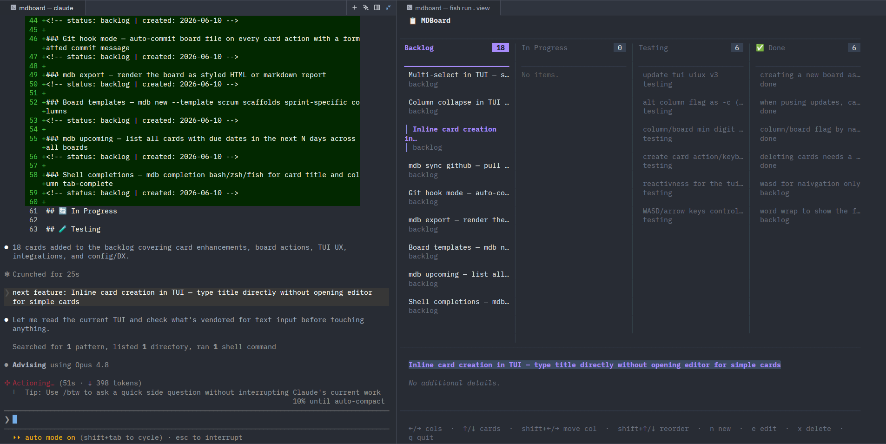

<div align="center">
  

  <h1>mdboard</h1>

  <p><strong>Markdown kanban boards for the terminal.</strong><br>
  Plain files. No server. No lock-in. Moves as fast as you do.</p>

  <p>
    
    
    
  </p>
</div>

---



---

## What is mdboard?

Each `.md` file is a board. Cards live under `##` column headings as `###` card titles. Metadata is stored in HTML comments so files stay fully human-readable and git-diffable. Works from the terminal, editable in any text editor, committable to any repo.

## Ship features faster with AI

mdboard works equally well as a manual tool or as the backbone of an AI-assisted development loop. Because the board is just a markdown file, any AI coding assistant can read it, reason about it, and act on it directly.

A typical AI-assisted loop looks like this:

```
1. Add backlog items to your board (manually or via `mdb add`)
2. Open your AI assistant and point it at your board file
3. Ask it: "What's next on the backlog? Implement it."
4. AI reads the board, implements the feature, marks the card done
5. Review, commit, repeat
```

The board becomes a living specification — you decide priorities, the AI executes. No special integration required: it's just a file. Works with Claude Code, Cursor, Copilot, or any tool that can read your project.

> **mdboard doesn't require AI.** Everything works manually via CLI and TUI. AI is an optional accelerator, not a dependency.

---

## Works great with teams

Because your board is a markdown file that lives inside your repo, it travels with your code — no third-party accounts, no SaaS subscriptions, no browser tabs to keep open alongside your editor. Everything that applies to your source files applies to your board: branching, merging, pull requests, code review, and history.

**Why teams choose mdboard over external tools:**

- **No external dependencies.** Unlike Jira, Linear, Trello, Asana, or GitHub Projects, there is nothing to log into, sync, or pay for. The board is just a file.
- **Git is the source of truth.** Card changes are commits. Every move, claim, and update is tracked, attributable, and reversible through the same `git log` your team already uses.
- **Works with your existing workflow.** Open a feature branch, update the board, commit both together. The PR diff shows code changes *and* board changes side by side. Reviewers see exactly what was done and what moved.
- **No context switching.** Stay in the terminal. No browser, no Electron app, no separate window — just `mdb view` from wherever you already are.
- **Scales down to solo, up to teams.** A single-person project and a 10-person team use the same file format and the same commands. There is nothing to configure differently as the team grows.

Your standup, your sprint, your backlog — all of it versioned alongside the code it describes.

---

## Install

```bash
git clone https://github.com/NathanielRand/mdboard
cd mdboard
chmod +x install.sh
./install.sh
```

Requires Go 1.22+.

All commands work with either `mdboard` or the shorter `mdb` alias interchangeably.

## Quick Start

```bash
# Create a new board (auto-registers it for this project root)
mdb new "Project Roadmap"

# Set your git username for this project
mdb config set git_user <USERNAME>

# Add cards
mdb add "Design the API"
mdb add "Build the frontend" --col "In Progress"

# Claim a card
mdb claim "Design the API"

# Move a card (column by name, partial match, fuzzy, or index)
mdb move "Design the API" "In Progress"
mdb move "Design the API" -c 2

# View as interactive TUI
mdb view

# Print text summary
mdb status

# List all boards in current directory
mdb list

# Upgrade to the latest version
mdb upgrade
```

## Commands

| Command | Description |
|---|---|
| `mdb new <title>` | Scaffold a new board `.md` file and register it for this project root |
| `mdb add <title>` | Add a card (defaults to first column) |
| `mdb add <title> --col <column>` | Add a card to a specific column |
| `mdb move <title> <column>` | Move a card to a different column |
| `mdb move <title> -c <column>` | Move using `-c`/`--col` flag (column by name, partial, fuzzy, or index) |
| `mdb shift <title> <up\|down>` | Shift a card up or down within its column |
| `mdb update <title>` | Edit a card's title or body (`--title`, `--body`) |
| `mdb claim <title>` | Claim a card with your git username |
| `mdb claim <title> --user <name>` | Claim with a specific username |
| `mdb unclaim <title>` | Remove claim from a card |
| `mdb remove <title>` | Delete a card (prompts for confirmation; aliases: `rm`, `delete`) |
| `mdb view` | Interactive TUI board viewer |
| `mdb status` | Text summary of the board |
| `mdb list` | List all `.md` boards in current directory |
| `mdb config show` | Show current project config (walks up to find project root) |
| `mdb config set <key> <value>` | Set a value in the project config (e.g. `git_user`) |
| `mdb upgrade` | Fetch and install the latest version of mdboard |
| `mdb doctor` | Check installation health and repair common issues (missing `mdb` alias, PATH, etc.) |
| `mdb uninstall` | Remove mdboard and the `mdb` alias from `/usr/local/bin` |

**Board auto-detection:** `mdb new` registers the board in `.mdboard/config.yaml` at the project root. After that, `mdb view` (and all other commands) automatically find the right board when run from anywhere within the project — no `--file` flag needed.

All commands also accept `--file <path>` to explicitly target any `.md` board file.

## TUI Controls

| Key | Action |
|---|---|
| `←` / `→` | Navigate columns |
| `↑` / `↓` | Navigate cards |
| `shift+←` / `shift+→` | Move card to previous/next column |
| `shift+↑` / `shift+↓` | Reorder card up/down within column |
| `n` | Create a new card inline (type title, Enter to confirm, Esc to cancel) |
| `e` / `Enter` | Edit the selected card |
| `x` / `Del` | Delete the selected card |
| `q` / `Esc` | Quit |

## Board File Format

Boards are plain markdown files. You can edit them by hand at any time:

```markdown
---
board: Project Roadmap
---

## 📋 Backlog

### Design the API
<!-- status: backlog | created: 2026-05-28 -->
- Define endpoints
- Write OpenAPI spec

## 🔄 In Progress

### Build the frontend
<!-- status: in-progress | user: NathanielRand | claimed: 2026-05-28 -->
- SvelteKit setup
- Connect to backend

## 🧪 Testing

## ✅ Done
```

## Config

Config is stored **per-project** at `.mdboard/config.yaml` in the project root — created automatically when you run `mdb new`. There is no global config file.

```yaml
board: my-project.md
git_user: <USERNAME>
default_columns:
  - Backlog
  - In Progress
  - Testing
  - Done
```

- `board` — set automatically by `mdb new`; points to the board file for this project
- `git_user` — set with `mdb config set git_user <name>`; used by `mdb claim`
- `default_columns` — edit this file directly to customize what columns `mdb new` scaffolds

All commands walk up from the current directory to find the nearest `.mdboard/config.yaml`, so they work correctly from any subdirectory within the project.

## Card & Column Matching

Card titles and column names are matched by **case-insensitive partial string**, with **fuzzy matching** as a fallback. So if your card is titled `"Fix authentication token expiry"`, you can refer to it as:

```bash
mdb claim "auth token"
mdb move "token expiry" Done
```

Column names follow the same rules — `mdb move "my card" prog` matches `In Progress`, and `mdb move "my card" -c 2` selects the second column by index.

If a partial match is ambiguous, mdboard will list all matches and ask you to be more specific.
